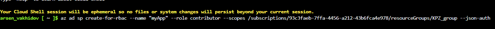
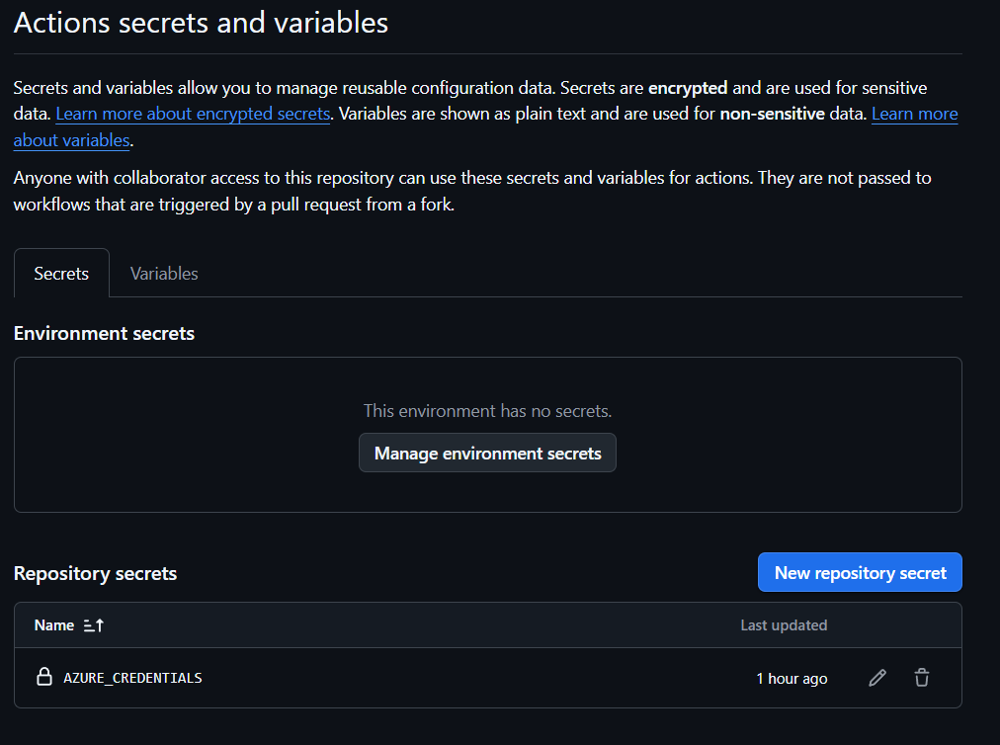
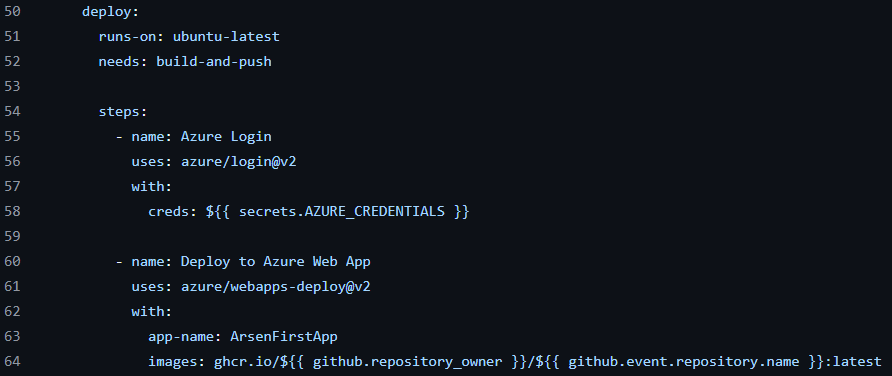
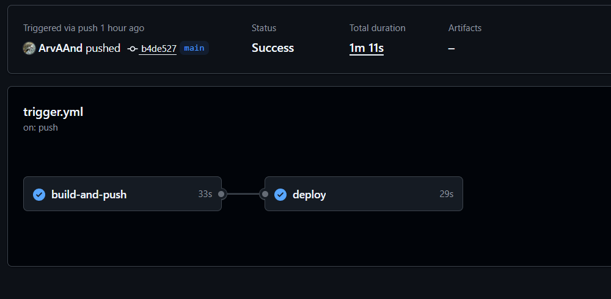
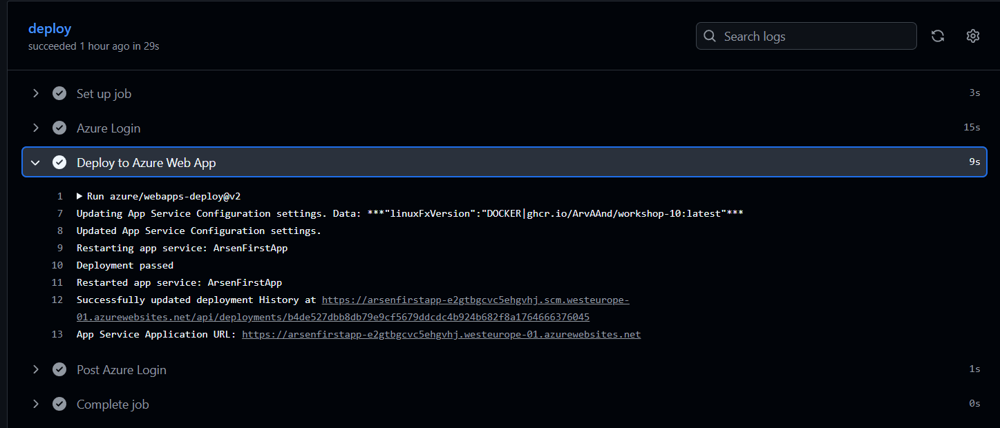
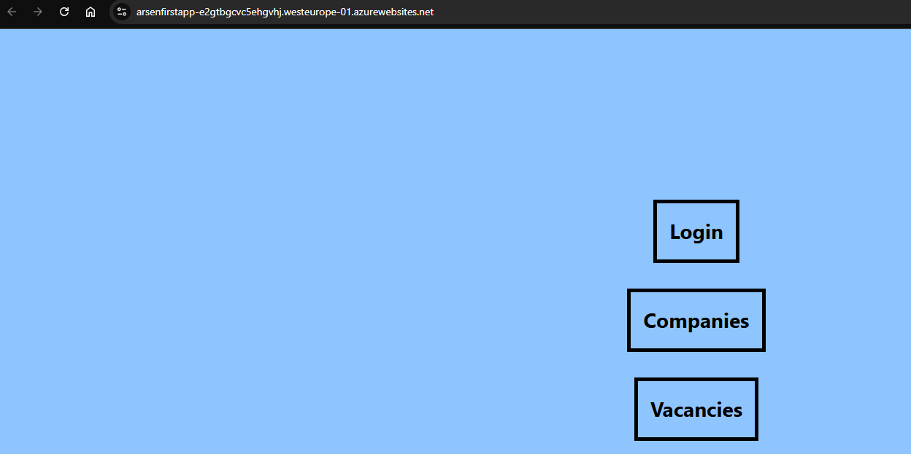

# Лабораторна робота №9

Тема: Неперервна доставка

Завдання:
1. Створив Azure App Service у власній підписці Azure:
a. Створив ресурсну групу (resource group)
b. Створив всередині ресурсної групи App Servicе

2. Створив у Azure Service principal, який буде використовуватись для доступу
GitHub до моєї підписки Azure.

3. Отримавши консольний вівід, створив New Repository Secret.

4. Додав нову job в мій github workflow, створений на попередньому занятті.

5. Dоркфлоу завершився успішно.

6. В логах степу Deploy to Azure Web App рядок який починається з App Service Application Url 

#### Посилання - https://arsenfirstapp-e2gtbgcvc5ehgvhj.westeurope-01.azurewebsites.net/

Висновки: Ознайомився з принципами і практиками неперервної доставки та сформував навички роботи з хмарними сервісами Azure.
